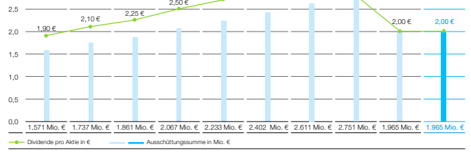

|                                                                                                                        | 2             |        |        |
|------------------------------------------------------------------------------------------------------------------------|---------------|--------|--------|
| Kennzahlen zur Bayer-Aktie                                                                                             | 2020          | 2021   |        |
| Konzernergebnis je Aktie aus fortzuführendem und nicht  fortgeführtem Geschäft                                         | in €          | –10,68 | 1,02   |
| Bereinigtes Konzernergebnis je Aktie aus fortzuführendem Geschäft1                                                     | in €          | 6,39   | 6,51   |
| Free Cashflow je Aktie                                                                                                 | in €          | 1,37   | 1,44   |
| Eigenkapital je Aktie                                                                                                  | in €          | 31,22  | 33,76  |
| Dividende je Aktie                                                                                                     | in €          | 2,00   | 2,00   |
| Börsenkurs zum Jahresende²                                                                                             | in €          | 48,16  | 47,00  |
| Höchstkurs²                                                                                                            | in €          | 78,29  | 57,30  |
| Tiefstkurs²                                                                                                            | in €          | 40,36  | 44,26  |
| Ausschüttungssumme                                                                                                     | in Mio. €     | 1.965  | 1.965  |
| Anzahl dividendenberechtigter Aktien (31.12.)                                                                          | in Mio. Stück | 982,42 | 982,42 |
| Marktkapitalisierung (31.12.)                                                                                          | in Mrd. €     | 47,3   | 46,2   |
| Durchschnittliche tägliche Umsätze                                                                                     | in Mio. Stück | 4,2    | 3,3    |
| Kurs-Gewinn-Verhältnis²                                                                                                | –4,5          | 46,2   |        |
| Bereinigtes Kurs-Gewinn-Verhältnis²                                                                                    | 7,5           | 7,2    |        |
| Kurs-Free Cashflow-Verhältnis²                                                                                         | 35,2          | 32,6   |        |
| Dividendenrendite²                                                                                                     | in %          | 4,2    | 4,3    |
| 1 Zur Berechnung des bereinigten Ergebnisses je Aktie siehe Zusammengefasster Lagebericht, A 2.3  2 XETRA-Schlusskurse |               |        |        |

Stabile Dividendenpolitik Wir behalten unsere Dividendenpolitik mit dem Ziel einer Ausschüttungsquote im Bereich von 30 bis 40 % des bereinigten Ergebnisses je Aktie (Core EPS) bei. Vorstand und Aufsichtsrat schlagen der Hauptversammlung eine Dividende in Höhe von 2,00 € je Aktie vor (Vorjahr: 2,00 € je Aktie). Dies entspricht ca. 31 % unseres Core EPS in Höhe von 6,51 € für das Geschäftsjahr 2021. Auf Basis des Aktienkurses der Bayer-Aktie zum Jahresende 2021 beträgt die Dividendenrendite 4,3 %. 

|                                                                |        | 3      |        |        |      |      |
|----------------------------------------------------------------|--------|--------|--------|--------|------|------|
| Dividende pro Aktie und Ausschüttungssumme 2012 2013 2014 2015 | 2016   | 2017   | 2018   | 2019   | 2020 | 2021 |
| 3,0                                                            | 2,70 € | 2,80 € | 2,80 € | 2,80 € |      |      |
|                                                                | 2,50 € |        |        |        |      |      |
|                                                                | 2,10 € | 2,25 € |        |        |      |      |
|                                                                | 1,90 € | 2,00 € | 2,00 € |        |      |      |
| 2,5 2,0 1,5 1,0                                                |        |        |        |        |      |      |

zur Definition bereinigtes Ergebnis je Aktie siehe A 2.3 

